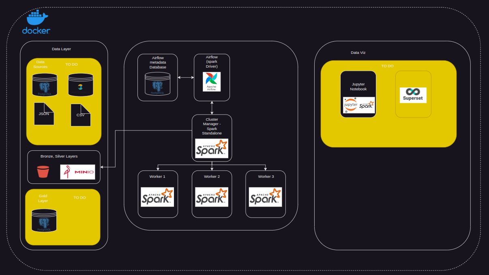

# datalakehouse-standalone-stack

This project was created to reinforce my initial studies in DevOps, specifically focusing on Docker. The goal is to create a simple pipeline that incorporates all the necessary tools to build a data pipeline. By including the most widely used tools in the market, this project provides a platform to study and implement new ideas and insights related to data processing.

## Table of Contents

- [Introduction](#introduction)
- [Tools Used](#tools-used)
- [Architecture Overview](#architecture-overview)
- [Getting Started](#getting-started)

## Introduction

The stack utilized in this project enables the recreation of a complete environment for data pipeline development. By leveraging Docker, it becomes easy to set up and manage the various components required for the pipeline. This includes tools for data ingestion, processing, transformation, and analysis.

By working with this project, you will gain hands-on experience with popular technologies used in the field of data engineering and gain a deeper understanding of how these tools integrate within a pipeline. It also serves as a platform to experiment and explore new approaches to data processing, allowing for the implementation of innovative ideas and solutions.

The project was divided in two main areas, data processing tools and data visualization, that enables a full pipeline from the source of data 
until the final destination that would be

## Tools Used

Database
- Orchestrator: Apache Airflow - Used to manage the data flow executions.
- Postgres: Airflow Metadata Database - Used to store metadata for Apache Airflow.
- Spark: A powerful tool for unified computing engine and parallel data processing.
- Minio: High-performance object storage compatible with Amazon libraries.

## Architecture Overview

Description - To do

## Getting Started
To start data flows tools

    docker compose -d -f docker/docker-compose.yaml up

To start data layer

    docker compose -d -f docker/docker-compose-data.yaml up

